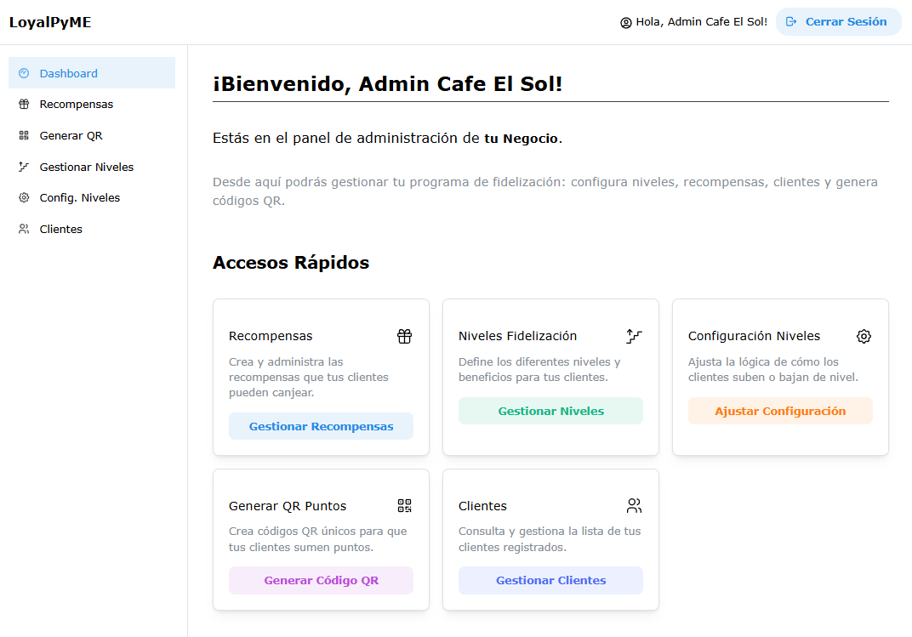
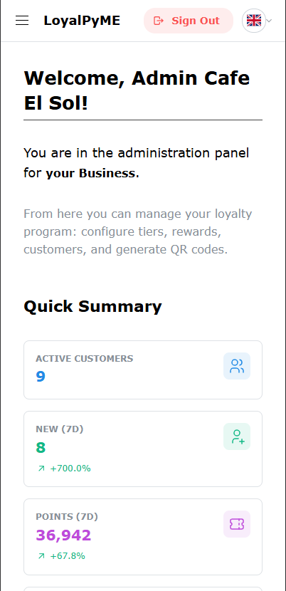

# LoyalPyME 🇪🇸

---

🇬🇧 [Read in English](README.md) | 🇪🇸 **Estás leyendo la versión en Español.**

---

# LoyalPyME 🇪🇸 (v1.12.0)

**LoyalPyME** es una plataforma web integral full-stack (Frontend React + Backend Node.js) diseñada para facilitar a las Pequeñas y Medianas Empresas (PyMEs) la gestión de un programa de fidelización de clientes digital potente, robusto, mantenible y escalable.

## Visión y Propósito ✨

LoyalPyME busca ser el aliado tecnológico de las PyMEs, proporcionando herramientas digitales integradas para fomentar la recurrencia, construir relaciones sólidas y mejorar la experiencia del cliente final, adaptándose a diversos sectores (hostelería, retail, servicios).

_(Consulta [PROJECT_STATUS.md](./PROJECT_STATUS.md) para ver las decisiones de diseño clave y la [DEVELOPMENT_PLAN.md](./DEVELOPMENT_PLAN.md) para la visión a largo plazo)._

|                                   Panel de Admin (Escritorio)                                   |                                      Panel de Admin (Móvil)                                      |
| :---------------------------------------------------------------------------------------------: | :----------------------------------------------------------------------------------------------: |
|  |  |

_(Nota: Las capturas podrían necesitar actualizarse)._

## Características Principales Implementadas ✅

- **Autenticación Completa:** Registro Negocio/Admin, Registro Cliente, Login (JWT), Reset Contraseña.
- **Gestión Clientes (Admin):** CRUD, Filtros, Búsqueda, Ordenación, Acciones Individuales/Masivas, Notas.
- **Gestión Niveles/Tiers (Admin):** CRUD Niveles, CRUD Beneficios por Nivel, Configuración Global del Sistema.
- **Gestión Recompensas (Admin):** CRUD Recompensas (Puntos), Subida/Recorte 1:1 Imagen (Cloudinary), **Soporte Multi-idioma (ES/EN)** para nombre y descripción.
- **Flujo Puntos/QR:** Generación QR (Admin), Validación QR (Cliente - Manual/Escáner Móvil `html5-qrcode`).
- **Lógica Tiers Automática:** Cálculo y asignación/descenso basado en configuración (Backend + Cron).
- **Panel Cliente:** Pestañas (Resumen, Recompensas, Actividad), Info Usuario (Puntos, Nivel, Beneficios), Barra Progreso (con Preview Siguiente Nivel), Lista Recompensas/Regalos (con imágenes), Canje Puntos/Regalos (directo desde Resumen y pestaña Recompensas), Escáner QR funcional.
- **Historial de Actividad (Cliente):** Visualización paginada de puntos ganados, recompensas y regalos canjeados.
- **Otros:** Internacionalización (ES/EN), Documentación API (Swagger), Logo Estático, Layout Cabecera Restringido.

## Estado Actual y Próximos Pasos 🗺️

El proyecto ha completado la **Fase 1 (Núcleo Funcional)** y está **avanzando significativamente en la Fase 2 (Funcionalidades Iniciales y Mejoras)** - Versión actual: **v1.12.0**.

- Consulta **[PROJECT_STATUS.md](./PROJECT_STATUS.md)** para ver los **hitos completados en detalle** y los **próximos pasos inmediatos**.
- Consulta **[DEVELOPMENT_PLAN.md](./DEVELOPMENT_PLAN.md)** para ver el **backlog completo** de tareas pendientes y las **ideas futuras** detalladas.

## Tecnologías Utilizadas 🛠️

**Frontend:** React, TypeScript, Vite, Mantine UI (v7+), Axios, React Router DOM (v6+), `html5-qrcode`, `react-image-crop`, `i18next`...
**Backend:** Node.js, Express, TypeScript, Prisma, PostgreSQL, JWT, bcryptjs, Cloudinary, Multer, Vitest, Supertest, Swagger...

_(Lista detallada en [PROJECT_STATUS.md](./PROJECT_STATUS.md))_

## Inicio Rápido (Desarrollo Local) 🚀

1.  Clonar repositorio.
2.  **Backend:** `cd backend && yarn install`, configurar `.env` completo, `npx prisma migrate dev`, `npx prisma generate`, (opcional `db seed` o registrar admin vía app), ejecutar con `npx tsc --watch` y `npx nodemon dist/index.js`.
3.  **Frontend:** `cd ../frontend && yarn install`, ejecutar con `yarn dev --host`.
4.  Acceder: `https://localhost:5173`.

**¡Importante!** Consulta la **[SETUP_GUIDE.md](./SETUP_GUIDE.md)** para obtener instrucciones **detalladas** y la **[TROUBLESHOOTING_GUIDE.md](./TROUBLESHOOTING_GUIDE.md)** para problemas comunes.

---

## Contribuciones 🤝

¡Contribuciones bienvenidas! Flujo estándar: Fork -> Branch -> Commit -> Push -> Pull Request. Revisa [DEVELOPMENT_PLAN.md](./DEVELOPMENT_PLAN.md) para ver tareas pendientes o proponer nuevas ideas.

## Licencia 📜

Licencia: **MIT**. Ver [`LICENSE`](./LICENSE).
Copyright (c) 2024-2025 Olivier Hottelet

## Contacto 📧

- **Olivier Hottelet**
- olivierhottelet1980@gmail.com
