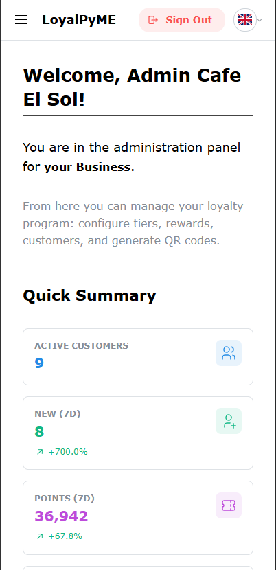

# LoyalPyME 🇬🇧

---

🇬🇧 **You are reading the English version.** | 🇪🇸 [Leer en Español](README.es.md)

---

# LoyalPyME 🇬🇧 (v1.13.0)

**LoyalPyME** is a comprehensive and modular full-stack web platform (React Frontend + Node.js Backend) designed for Small and Medium-sized Enterprises (SMEs). It currently includes:

- **LoyalPyME Core:** A robust system for managing digital customer loyalty programs (points, tiers, rewards, QR codes).
- **Coming Soon: LoyalPyME Waiter:** An advanced module for digitizing and optimizing service operations in the hospitality sector (digital menu, table-side ordering, KDS, waiter interface).

The platform is designed to be maintainable, scalable, and adaptable to business needs.

## Vision and Purpose ✨

LoyalPyME aims to be the technological ally for SMEs by providing integrated digital tools.
With **LoyalPyME Core**, businesses foster repeat custom and build strong customer relationships.
With the upcoming **LoyalPyME Waiter**, hospitality businesses will optimize their service, reduce operational costs, and enhance the end-customer experience.
The platform adapts to various sectors, with an initial focus on retail, services (for LCo), and hospitality (for LC).

_(See [PROJECT_STATUS.md](./PROJECT_STATUS.md) for key design decisions and [DEVELOPMENT_PLAN.md](./DEVELOPMENT_PLAN.md) for the long-term vision and module status)._

|                                    Admin Dashboard (Desktop)                                    |                                       Admin Dashboard (Mobile)                                       |
| :---------------------------------------------------------------------------------------------: | :--------------------------------------------------------------------------------------------------: |
|  |  |

_(Note: Screenshots might need updating to reflect modules and the Super Admin panel)._

## Key Implemented Features (Base Platform & LoyalPyME Core) ✅

- **Multi-Module Management (Base):**
  - Super Admin panel for global management of client businesses.
  - Activation/Deactivation of modules (e.g., LoyalPyME Core, LoyalPyME Waiter) per business.
  - Access control to functionalities based on active modules for each business.
- **LoyalPyME Core (Loyalty Module):**
  - **Full Authentication:** Business/Admin Registration, Customer Registration, Login (JWT), Password Reset.
  - **Customer Management (Admin LCo):** CRUD, Filters, Search, Sorting, Individual/Bulk Actions, Notes.
  - **Tier & Benefit Management (Admin LCo):** Tier CRUD, Benefit CRUD per Tier, Global Tier System Settings.
  - **Reward Management (Admin LCo):** Reward CRUD (Points-based), Image Upload & 1:1 Cropping (Cloudinary), Multi-language support (ES/EN) for name/description.
  - **Points & QR Flow (LCo):** QR Code Generation (Admin), QR Validation (Customer - Manual/Mobile Scanner).
  - **Automatic Tier Logic (LCo):** Tier Calculation/Assignment/Downgrade based on business settings (Backend + Cron Job).
  - **Customer Dashboard (LCo):** Tab-based Interface (Summary, Rewards, Activity), User Info (Points, Tier, Benefits), Progress Bar (with Next Tier Preview), Reward/Gift List, Points/Gift Redemption, QR Scanner.
  - **Customer Activity History (LCo):** Paginated timeline view of points earned and redemptions.
- **Other (Platform):** Frontend Internationalization (i18n - ES/EN), API Documentation (Swagger), Static Logo, Constrained Header Layout.

## Project Status & Roadmap 🗺️

The project has completed **Phase 1 (LCo Core Functionality)** and the **base implementation for multi-module management and the Super Admin Panel**. Current version: **v1.13.0**.

- Development is now focused on the **"LoyalPyME Waiter" module** for the hospitality sector.
- See **[PROJECT_STATUS.md](./PROJECT_STATUS.md)** for **detailed completed milestones** and **immediate next steps**.
- See **[DEVELOPMENT_PLAN.md](./DEVELOPMENT_PLAN.md)** for the **full backlog** of pending tasks and detailed **future ideas**.

## Used Technologies 🛠️

**Frontend:** React, TypeScript, Vite, Mantine UI (v7+), Axios, React Router DOM (v6+), `html5-qrcode`, `react-image-crop`, `i18next`, Zustand (or similar for global state management if needed in the future)...
**Backend:** Node.js, Express, TypeScript, Prisma, PostgreSQL, JWT, bcryptjs, Cloudinary, Multer, Vitest, Supertest, Swagger, `node-cron`...

_(Detailed and updated list in [PROJECT_STATUS.md](./PROJECT_STATUS.md))_

## Quick Start (Local Development) 🚀

1.  Clone repository.
2.  **Backend:** `cd backend && yarn install`, configure `.env` completely (see `.env.example`), `npx prisma migrate reset` (deletes and recreates DB), `npx prisma db seed` (for demo data), `npx ts-node ./scripts/create-superadmin.ts` (to create superadmin user), run with `npx tsc --watch` & `npx nodemon dist/index.js`.
3.  **Frontend:** `cd ../frontend && yarn install`, run with `yarn dev --host`.
4.  **Access:**
    - Customer/Business Admin App: `https://localhost:5173`
    - Super Admin Panel: `https://localhost:5173/superadmin` (login with credentials from `create-superadmin.ts`)
    - Demo Business (seed): `admin@demo.com` / `password`
    - Demo Customer (seed): `cliente@demo.com` / `password`

**Important!** Refer to the **[SETUP_GUIDE.md](./SETUP_GUIDE.md)** for **complete, detailed** instructions. For common issues, check the [TROUBLESHOOTING_GUIDE.md](./TROUBLESHOOTING_GUIDE.md).

---

## Contributions 🤝

Contributions welcome! Standard flow: Fork -> Branch -> Commit -> Push -> Pull Request. Check [DEVELOPMENT_PLAN.md](./DEVELOPMENT_PLAN.md) for pending tasks or to propose new ideas.

## License 📜

Licensed under **MIT**. See [`LICENSE`](./LICENSE) file.
Copyright (c) 2024-2025 Olivier Hottelet

## Contact 📧

- **Olivier Hottelet**
- olivierhottelet1980@gmail.com
